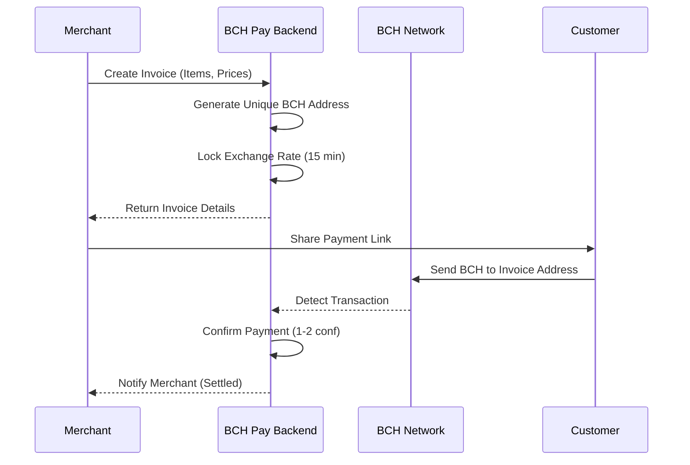

# BCH Pay - Professional Bitcoin Cash Payment Gateway

BCH Pay is a modern, non-custodial Bitcoin Cash payment gateway and merchant dashboard. It empowers merchants to accept BCH payments directly into their own wallets, providing a seamless, secure, and transparent payment experience for both customers and businesses.

## 🌟 Project Overview

BCH Pay bridges the gap between traditional commerce and the Bitcoin Cash ecosystem. By providing a user-friendly dashboard and a robust API, it allows any merchant to start accepting BCH in minutes without relying on a centralized intermediary.

### Why BCH Pay?
- **Non-Custodial**: You own your keys, you own your coins. Funds go directly to addresses you control.
- **Low Fees**: Leverage the extremely low transaction fees of the Bitcoin Cash network.
- **Fast Confirmations**: Near-instant transaction detection and fast settlement.
- **Itemized Billing**: Professional invoices that look and feel like traditional payment systems.

---

## 🔄 How It Works (Process Flow)



1.  **Invoice Creation**: The merchant enters items and prices in the dashboard.
2.  **Address Generation**: The backend generates a unique BCH address for each invoice using a secure derivation path.
3.  **Price Locking**: The system fetches the real-time BCH price and locks it for 15 minutes to protect against volatility.
4.  **Payment Detection**: The backend monitors the blockchain for incoming transactions to the specific invoice address.
5.  **Settlement**: Once confirmed, the merchant is notified, and the funds are ready for use or automatic conversion.

---

## 🛠 Technical Architecture

### Frontend (Next.js)
- **Merchant Dashboard**: A sleek interface for managing invoices, viewing revenue stats, and configuring settings.
- **Invoice Modal**: Dynamic itemized list builder with real-time total calculation.
- **Payment Page**: A customer-facing UI with QR codes and real-time payment status updates.
- **State Management**: React hooks for local state and API integration for persistent data.

### Backend (Node.js/Express)
- **Invoice Service**: The core logic for address generation, payment tracking, and status management.
- **Price Service**: Integrates with CoinGecko to provide accurate, real-time BCH/Fiat exchange rates.
- **Blockchain Service**: Powered by `@psf/bch-js` and `bchaddrjs-slp` for direct interaction with the BCH network.
- **Notification Service**: (In-Progress) Handles email or webhook notifications for payment events.

---

## 📁 Project Structure

```text
BCH-project/
├── frontend/           # Next.js Web Application
│   ├── src/app/        # App Router (Dashboard, Payment Pages)
│   ├── src/components/ # Reusable UI Components
│   └── src/lib/        # API Clients & Utilities
└── backend/            # Node.js Express API
    ├── src/models/     # Mongoose Schemas (Invoice, Merchant)
    ├── src/services/   # Business Logic (BCH, Price, Invoices)
    └── src/routes/     # API Endpoints
```

---

## ⚙️ Getting Started

### Prerequisites
- **Node.js**: v18 or higher recommended.
- **MongoDB**: A running instance (local or Atlas).
- **FullStack.cash API Key**: Required for blockchain interactions (free tier available).

### Installation & Setup

1.  **Clone & Install**:
    ```bash
    git clone https://github.com/your-username/BCH-project.git
    cd BCH-project
    npm install # If there's a root package.json, otherwise install in subdirs
    ```

2.  **Configure Backend**:
    - Navigate to `backend/`.
    - Create a `.env` file based on the provided documentation.
    - Run `npm run dev`.

3.  **Configure Frontend**:
    - Navigate to `frontend/`.
    - Run `npm run dev`.

---

## 🧪 Network Configuration (Testnet)

The project is currently configured for **BCH Chipnet** (Testnet) to allow for safe development and testing.

- **REST URL**: `https://chipnet.fullstack.cash/v6/`
- **Derivation Path**: `m/44'/1'/0'` (Standard Testnet path)
- **Address Prefix**: `bchtest:`

---

## 🛡 Security & Non-Custodial Nature

BCH Pay is designed with security as a priority:
- **Private Keys**: In this MVP, keys are generated and stored temporarily. In production, we recommend using an xPub-only approach where the backend never sees private keys.
- **Encryption**: Sensitive data like WIFs should be encrypted at rest (simplified for this demo).
- **No Middleman**: Funds are never held by BCH Pay; they are sent directly to the merchant's generated addresses.

---

## 📄 License

This project is licensed under the ISC License.
# BCH-Pay
